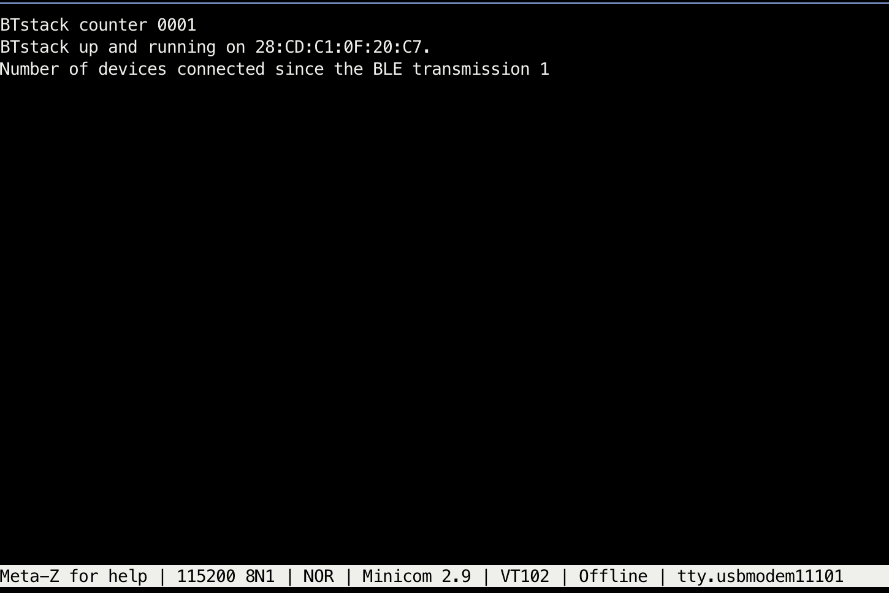

# Lab 11 Bluetooth

**Authors**: Jared & Muteeb

## Activity - advertising

- Changed the BLUETOOTH_DATA_TYPE_COMPLETE_LOCAL_NAME to 'Muteeb BLE'.
- Serial port prints:

```
BTstack counter 0001
BTstack up and running on 28:CD:C1:0F:20:C7.
```

**Muteeb BLE Advertising**


## Activity - attributes, services, and characteristics.

### Task 1

|  |  |
| ---------------------------------------------------------------------- | ---------------------------------------------------------------------------------------- |
| Muteeb BLE Services                                                    | Muteeb BLE Battery Service Properties                                                    |

### Task 2

|  |
| --------------------------------------------------------------------------------------- |
| Muteeb BLE Gatt Services Name Change                                                    |

### Task 3

|  |
| --------------------------------------------------------------------------------------------------------------------------------------------------- |
| The characteristic has type GAP_DEVICE_NAME, is read only, and includes a literal string value.                                                     |

## Activity 3 - HCI packet handling

Improved our debugging by logging whenever a client connects to our device.



## Activity 4 - add a service

Temperature Service


